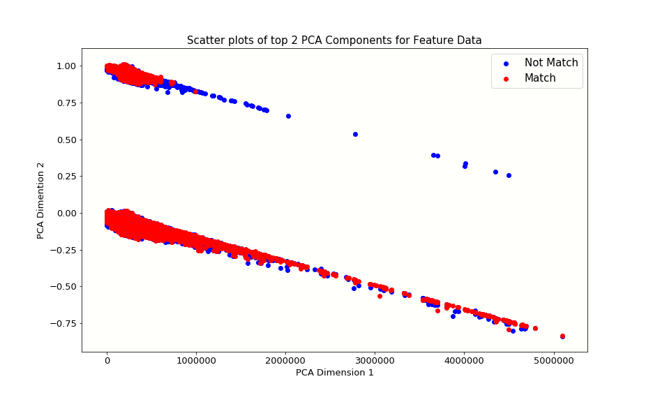

## Table of Contents
[Project Statement and Goals](https://tralpha.github.io/spotify-project/project-statement-and-goals.html) <br>
[Motivation and Background](https://tralpha.github.io/spotify-project/motivation-and-background.html) <br>
[Data Description](https://tralpha.github.io/spotify-project/data-description.html) <br>
[EDA](https://tralpha.github.io/spotify-project/eda.html) <br>
[Data Cleaning](https://tralpha.github.io/spotify-project/data-cleaning.html) <br>
[Metrics](https://tralpha.github.io/spotify-project/metrics.html) <br>
[Model Training](https://tralpha.github.io/spotify-project/model-training.html) <br>
[Interpreting the Model](https://tralpha.github.io/spotify-project/interpreting-the-model.html) <br>
[Model Testing and Results](https://tralpha.github.io/spotify-project/model-testing-and-results.html) <br>
[Conclusion and What's Next](https://tralpha.github.io/spotify-project/conclusion.html) <br>
[Literature Review](https://tralpha.github.io/spotify-project/literature-review.html) <br>


# Conclusion and What's Next?

## Conclusion

### Working with 1,000,000 Playlists
One idea we could use to better handle computing on the full dataset is principal component analysis.  By narrowing down our set of features we could train models faster and experiment more with model tuning.  We did create a visualization to see how we can differentiate between `match = 0` and `match = 1` tracks using the first 2 principal components.  We can see that even just two components with 41,000 playlists loaded start to discriminate between our two target categories.  It would be fascinating to think more about how this works and what the right number of components would be for an accurate model that is also easier to train on a large percentage of the data.

**Principal Component Analysis code:**
```python
#Can't do sklearn PCA on sparse matrix object, use TruncatedSVD instead
from sklearn.decomposition import TruncatedSVD
pca_transformer = TruncatedSVD(2).fit(X_train) 
X_train_2d = pca_transformer.transform(X_train)
X_test_2d = pca_transformer.transform(X_test)
```

**Plot**
*Credit to HW4 for lab for code template*
```python
colors = ['b', 'r']
label_text = ["Not Match", "Match"] 
plt.figure(figsize = (10,6))
for cur_quality in [0, 1]:
    cur_df = X_train_2d[y_train == cur_quality] 
    plt.scatter(
        cur_df[:, 0],
        cur_df[:, 1], 
        c=colors[cur_quality], 
        label=label_text[cur_quality])
plt.xlabel("PCA Dimension 1", fontsize = 13)
plt.ylabel("PCA Dimention 2", fontsize = 13)
plt.title("Scatter plots of top 2 PCA Components for Feature Data", fontsize = 15) 
plt.tick_params(labelsize = 13)
plt.grid(alpha = 0)
plt.legend();
```
*Note the **Data Cleaning** section of this site:  we have populated each playlist in our dataset with randomly choosen songs that were not originally present.  These songs are equal in number to the songs that actually belong to the playlist as choosen by Spotify users.  The songs that were originally present we label with the target category `match = 1` and the randomly assigned songs are labeled with the target category `match = 0`*


### Separating a Validation Set and Tuning Hyperparameters

### Taking advantage of the Million Song Dataset
The MSD holds song specific feature information that would be useful for a model to be able to further recognize similarities between songs and recommend songs to a user that exhibit the qualities that user indicates they like by the name and description of their playlist, as well as the songs they already added.

### Leveraging Spotify's API
The most exciting part of this project would be to be able to easily create our own playlists and get recommendations from our model.  R-Precision is not the most heartening metric; it tend to be low even for the winners of the Spotify Competition and it's just a single number.  By using the Spotify API, we could much more fluidly interact with our model and render its recommendations much more palpable.
