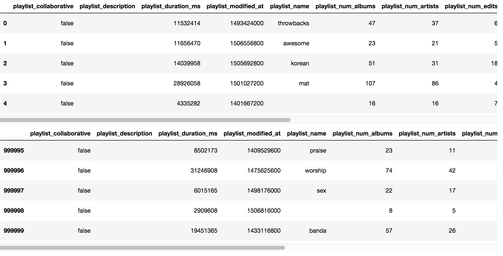
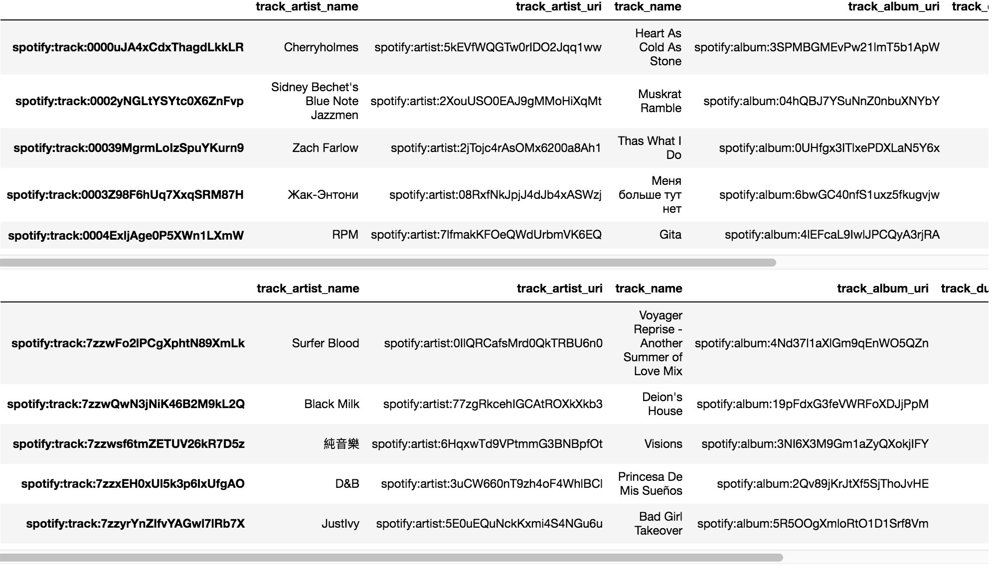
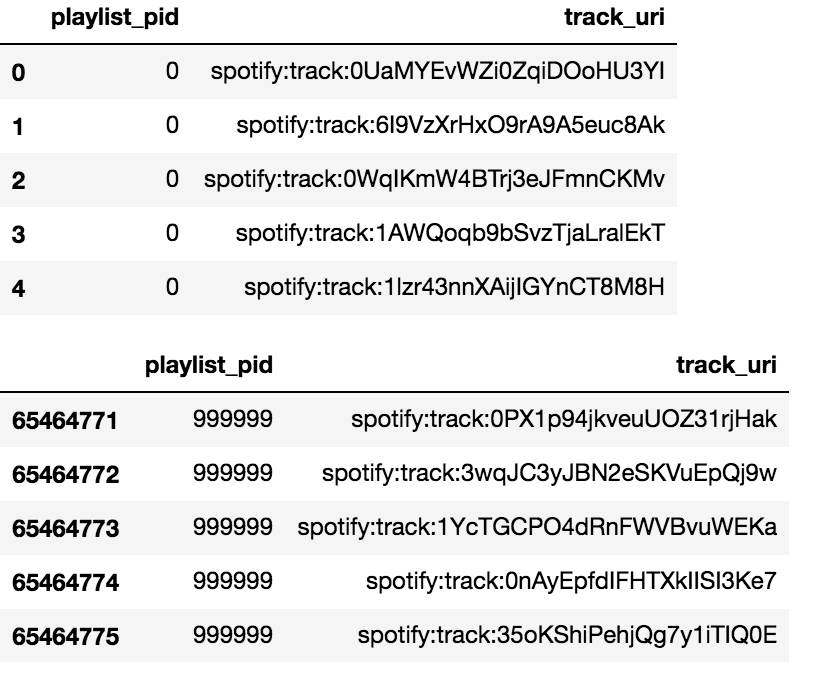
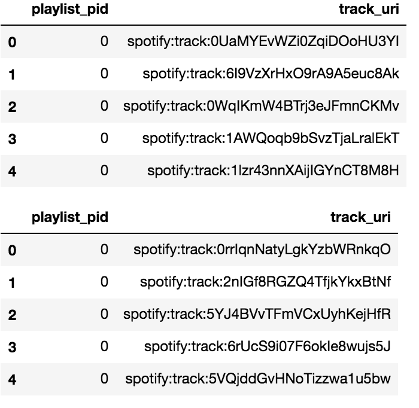

## Table of Contents
[Project Statement and Goals](https://tralpha.github.io/spotify-project/project-statement-and-goals.html) <br>
[Motivation and Background](https://tralpha.github.io/spotify-project/motivation-and-background.html) <br>
[Data Description](https://tralpha.github.io/spotify-project/data-description.html) <br>
[EDA](https://tralpha.github.io/spotify-project/eda.html) <br>
[Data Cleaning](https://tralpha.github.io/spotify-project/data-cleaning.html) <br>
[Metrics](https://tralpha.github.io/spotify-project/metrics.html) <br>
[Model Training](https://tralpha.github.io/spotify-project/model-training.html) <br>
[Interpreting the Model](https://tralpha.github.io/spotify-project/interpreting-the-model.html) <br>
[Model Testing and Results](https://tralpha.github.io/spotify-project/model-testing-and-results.html) <br>
[Conclusion and What's Next](https://tralpha.github.io/spotify-project/conclusion.html) <br>
[Literature Review](https://tralpha.github.io/spotify-project/literature-review.html) <br>

# Data Cleaning:
## Loading the data

The MPD is organized into 100 separate JSON files where each file contain 1'000 playlists. In order to give us flexibility we first load the data into four distict data structures:

1. A list containing all the *playlist*

2. A dictionary with all the *tracks*

3. A list that maps *songs* to *playlists*

4. A list that maps *duplicate songs* to *playlists*

The fourth data structure was added after we conducted the EDA. During the EDA we found out that a playlist can contain duplicate songs. Although this may make sense for someone that is creating a playlist manually, we feel that it does not make sense for a suggestion engine. Suggesting something that has already been played feels like cheating. We put all the duplicates into the last data structure, that way we could see how many duplicates there were and easily exclude them from further processing.

```python
playlists = list()
tracks = dict()
map_pl = list()
map_pl_duplicate = list()
max_files_for_quick_processing = 4

def process_track(track):
    key = track['track_uri']
    if not key in tracks:
        tk = dict()
        tk['track_artist_name'] = track['artist_name']
        tk['track_artist_uri'] = track['artist_uri']
        tk['track_name'] = track['track_name']
        tk['track_album_uri'] = track['album_uri']
        tk['track_duration_ms'] = track['duration_ms']
        tk['track_album_name'] = track['album_name']
        tk['track_pos'] = track['pos']
        tracks[track['track_uri']] = tk
    return key

def process_playlist(playlist):
    pl = dict()
    pl['playlist_name'] = playlist['name']
    pl['playlist_collaborative'] = playlist['collaborative']
    pl['playlist_pid'] = playlist['pid']
    pl['playlist_modified_at'] = playlist['modified_at']
    pl['playlist_num_albums'] = playlist['num_albums']
    pl['playlist_num_tracks'] = playlist['num_tracks']
    pl['playlist_num_followers'] = playlist['num_followers']
    pl['playlist_num_edits'] = playlist['num_edits']
    pl['playlist_duration_ms'] = playlist['duration_ms']
    pl['playlist_num_artists'] = playlist['num_artists']
    if 'description' in playlist:
        pl['playlist_description'] = playlist['description']
    else:
        pl['playlist_description'] = ''
    trks = set()
    for track in playlist['tracks']:
        if track['track_uri'] not in trks:
            trks.add(track['track_uri'])
            process_track(track)
            map_pl.append([playlist['pid'], track['track_uri']])
        else:
            map_pl_duplicate.append([playlist['pid'], track['track_uri']])
    return pl

def process_mpd(path):
    count = 0
    filenames = os.listdir(path)
    for filename in sorted(filenames):
        print(filename)
        if filename.startswith("mpd.slice.") and filename.endswith(".json"):
            fullpath = os.sep.join((path, filename))
            f = open(fullpath)
            js = f.read()
            f.close()
            slice = json.loads(js)
            for playlist in slice['playlists']:
                playlists.append(process_playlist(playlist))
            count += 1
            if quick and count > max_files_for_quick_processing:
                break

quick = True
process_mpd('mpd.v1/data')
```
After loading up the entire dataset we have:<br>
<b>1'000'000</b> playlists<br>
<b>2'262'292</b> tracks<br>
<b>65'464'776</b> songs in the playlists<br>
<b>881'652</b> duplicate songs<br>

## Pandas

We now convert our three data structures to Pandas data frames:

```python
playlist_df = pd.DataFrame(playlists)
tracks_df = pd.DataFrame.from_dict(tracks, orient='index')
playlist_map_df = pd.DataFrame(map_pl, columns=['playlist_pid', 'track_uri'])
```

<b>The playlist dataframe</b>
```python
playlist_df.head()
playlist_df.tail()
```


<b>The tracks dataframe</b>
```python
tracks_df.head()
tracks_df.tail()
```


<b>The playlist to song mapping dataframe</b>
```python
playlist_map_df.head()
playlist_map_df.tail()
```


## Negative Samples
**Here we first refer to our response variable "Match" which will be frequently referenced in our reporting**
<br>
In order to train our model we also need a negative sample set. We will add random songs to each playlist. We add a binary value called `match` which is used as the response variable for the model.<br>

We make a copy of the playlist to song mapping dataframe, we then randomly assign songs to playlist:
```python
playlist_map_df_negative = playlist_map_df.copy()
random = playlist_map_df.sample(n=len(playlist_map_df)).reset_index()
playlist_map_df_negative['track_uri'] = random['track_uri']
```

We verify that the new dataset is indeed scrambled by checking heads:
```python
playlist_map_df.head()
playlist_map_df_negative.head()
```


## Denormalizing the data
<br>
We cannot effectively use multiple data frames for our modelling. we next need to merge the data frames together. We first merge the dataset with the original data into a single data frame:
```python
merged = pd.merge(
    pd.merge(
        tracks_df, playlist_map_df, left_index=True, right_on='track_uri'),
    playlist_df,
    on='playlist_pid')
```

We also create a single dataframe of the scrambled *(negative samples)* data frame:
```python
negative_samples = pd.merge(
    pd.merge(
        tracks_df, playlist_map_df_negative, left_index=True, right_on='track_uri'),
    playlist_df,
    on='playlist_pid')
```
We now have two dataframes both with the same playlist, but the negative samples playlist has randomized its song contents. Before merging the datasets together we add the binary response variable `match`.  Each playlist will have a matching to not matching ratio of 1:1.
```python
negative_samples['match'] = 0
merged['match'] = 1
```

We merge the two datasets together:
```python
dataset = pd.concat([negative_samples, merged]).sort_values(by=['playlist_pid']).reset_index(drop=True)
```

## Train and Test split
<br>
The data is split into a train and a test set using a 70/30 split. We want equal ratios of songs from the playlists and also positive/negative samples in the two groups. We can achieve this by using the stratify parameter on the train_test_split:
<br>

```python
data_x = dataset.loc[:, dataset.columns != 'match']
data_y = dataset.match
data_train, data_test, y_train, y_test = train_test_split(
    data_x,
    data_y,
    test_size=0.3,
    stratify=dataset.playlist_pid,
    random_state=42,
    shuffle=True)
```

## Vectorizing the data
<br>
We vectorize the data on things like album, artist, artist, playlist. For the playlist name and the desciption we use a word vectorizer.
<br>

```python
# we need a custom pre-processor to extract correct field,
# but want to also use default scikit-learn preprocessing (e.g. lowercasing)
default_preprocessor = CountVectorizer().build_preprocessor()


def build_preprocessor(field):
    field_idx = list(dataset.columns).index(field)
    # if field == 'playlist_pid': from IPython.core.debugger import set_trace; set_trace()
    return lambda x: default_preprocessor(x[field_idx])


vectorizer = FeatureUnion([
    (
        'track_artist_uri',
        CountVectorizer(
            ngram_range=(1, 1),
            token_pattern=r".+",
            stop_words=None,
            preprocessor=build_preprocessor('track_artist_uri'))),
    (
        'track_album_uri',
        CountVectorizer(
            ngram_range=(1, 1),
            token_pattern=r".+",
            stop_words=None,
            preprocessor=build_preprocessor('track_album_uri'))),
    (
        'track_uri',
        CountVectorizer(
            ngram_range=(1, 1),
            token_pattern=r".+",
            stop_words=None,
            preprocessor=build_preprocessor('track_uri'))),

    (
        'playlist_pid',
        CountVectorizer(
            ngram_range=(1, 1),
            token_pattern=r".+",
            stop_words=None,
            preprocessor=build_preprocessor('playlist_pid'))),

    ("playlist_name",
      CountVectorizer(
            ngram_range=(1, 1),
            token_pattern=r"(?u)\b\w+\b",
            stop_words=None,
            analyzer = 'word',
            max_features=5000,
            preprocessor=build_preprocessor("playlist_name"))),
    
    ("playlist_description",
      CountVectorizer(
            ngram_range=(1, 1),
            token_pattern=r"(?u)\b\w+\b",
            stop_words=None,
            analyzer = 'word',
            max_features=5000,
            preprocessor=build_preprocessor("playlist_description"))),
    ('track_duration_ms',
     ItemSelector(list(dataset.columns).index('track_duration_ms'))),
])
X_train = vectorizer.fit_transform(data_train.values)

```

```python

class ItemSelector(BaseEstimator, TransformerMixin):
    """For data grouped by feature, select subset of data at a provided key.

    The data is expected to be stored in a 2D data structure, where the first
    index is over features and the second is over samples.  i.e.

    >> len(data[key]) == n_samples

    Please note that this is the opposite convention to scikit-learn feature
    matrixes (where the first index corresponds to sample).

    ItemSelector only requires that the collection implement getitem
    (data[key]).  Examples include: a dict of lists, 2D numpy array, Pandas
    DataFrame, numpy record array, etc.

    >> data = {'a': [1, 5, 2, 5, 2, 8],
               'b': [9, 4, 1, 4, 1, 3]}
    >> ds = ItemSelector(key='a')
    >> data['a'] == ds.transform(data)

    ItemSelector is not designed to handle data grouped by sample.  (e.g. a
    list of dicts).  If your data is structured this way, consider a
    transformer along the lines of `sklearn.feature_extraction.DictVectorizer`.

    Parameters
    ----------
    key : hashable, required
        The key corresponding to the desired value in a mappable.
    """
    def __init__(self, key):
        self.key = key

    def fit(self, x, y=None):
        return self

    def transform(self, data_dict):
        # if self.key == 'playlist_pid': from IPython.core.debugger import set_trace; set_trace()
        return data_dict[:,[self.key]].astype(np.int64)

    def get_feature_names(self):
        return [dataset.columns[self.key]]
        
```

```python
X_train = vectorizer.fit_transform(data_train.values)
X_test = vectorizer.transform(data_test.values)
```
