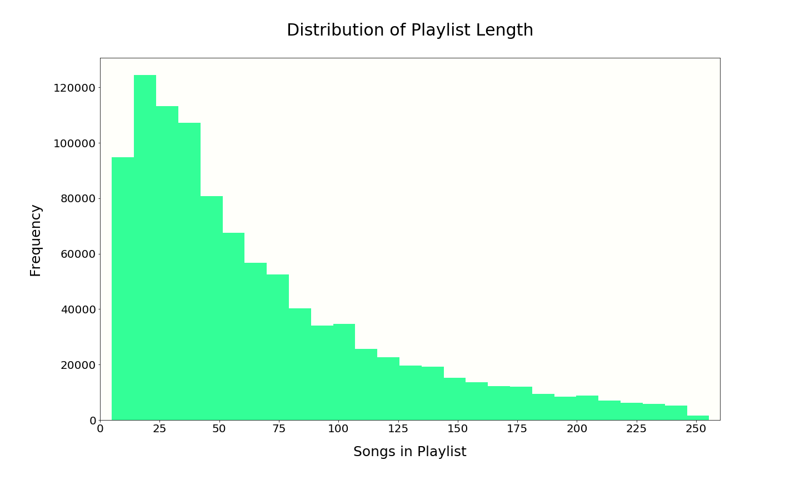
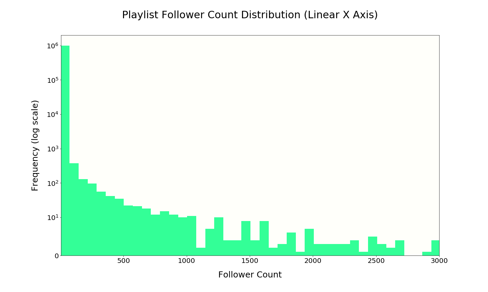
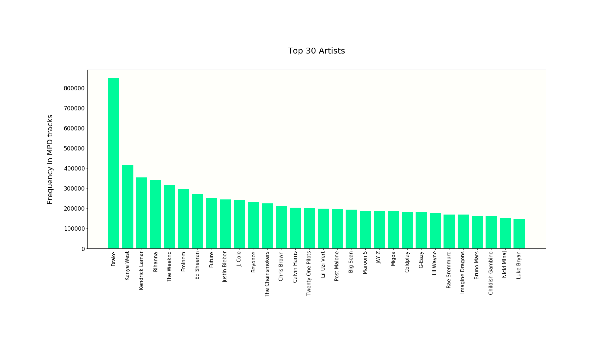
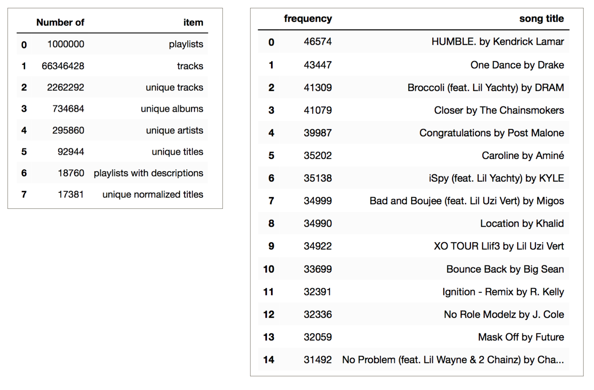

# Table of Contents
[Project Statement and Goals](https://tralpha.github.io/spotify-project/project-statement-and-goals.html) <br>
[Motivation and Background](https://tralpha.github.io/spotify-project/motivation-and-background.html) <br>
[Data Description](https://tralpha.github.io/spotify-project/data-description.html) <br>
[EDA](https://tralpha.github.io/spotify-project/eda.html) <br>
[Data Cleaning](https://tralpha.github.io/spotify-project/data-cleaning.html) <br>
[Metrics](https://tralpha.github.io/spotify-project/metrics.html) <br>
[Model Training](https://tralpha.github.io/spotify-project/model-training.html) <br>
[Interpreting the Model](https://tralpha.github.io/spotify-project/interpreting-the-model.html) <br>
[Model Testing and Results](https://tralpha.github.io/spotify-project/model-testing-and-results.html) <br>
[Literature Review](https://tralpha.github.io/spotify-project/literature-review.html) <br>

# Million Playlist Dataset:
This dataset contains 5.4 GB of data and was created in 2017. It contains the following information for each playlist and track within:


**Playlist specific features:**
- Playlist name
- Indicator if the playlist is a collaboration
- Date when it was last modified
- Number of albums the songs are from
- Number of songs in the playlist
- Number of followers the playlist has
- Number of edits
- Playlist duration
- Number of artists

**Song specific features:**
- Artist
- Track Uri
- Artist Uri
- Track Name
- Album Uri
- Duration
- Album Name


To get an idea of some broad features of the dataset, we plot some distributions.  Visualizing the number of tracks in the playlists and the number of followers across the playlists was useful in thinking about how some modeling ideas may work.


**Histogram of playlist length**

```python
from length_hist import length
#length is a dictionary that holds the playlist length distributions

histogram_data = []
for key in length:
    histogram_data += [key] * length[key]

fig, ax = plt.subplots(1,1, figsize = (20,12))
ax.hist(histogram_data, bins = 40, color = 'springgreen', alpha = .8)


ax.set_xlabel("Songs in Playlist", fontsize = 25, labelpad = 20)
ax.set_ylabel("Frequency", fontsize = 25, labelpad = 20)
ax.set_title("Distribution of Playlist Length", fontsize = 30, pad = 50)
ax.set_xlim(0,260)
ax.set_xticks(np.round(np.linspace(0, 250, 11)))
```

Playlist length approximately follows a power law distribution.  The playlists in the data set were selected by Spotify to have between 5 and 250 tracks. Many playlists naturally have about 25-50 tracks with 66 being the average track count.


**Histogram of playlist follower count**

```python
#followers is a dictionary with playlist follower histogram data
from followers import followers

followers_hist = []
for key in followers:
    followers_hist += [key] * followers[key]

fig, ax = plt.subplots(1,1, figsize = (20, 12))
ax.hist(followers_hist, bins = 1000, color = 'springgreen', alpha = .8)

titles = ["Linear X Axis", "Logorithmic X Axis"]
ax.set_xlim(5,3000)
ax.set_xlabel("Follower Count", fontsize = 25, labelpad = 20)
ax.set_ylabel("Frequency (log scale)", fontsize = 25, labelpad = 20)
ax.set_title("Playlist Follower Count Distribution (" + titles[0] + ")", fontsize = 30, pad = 50)
ax.set_yscale('symlog', linthreshy = 10)
```

Follower count also roughly follows a power law distribution. There are a handful of playlists with over 50,000 followers, but the large majority of playlists have only a few followers.  We expect to see much more variance between playlists than would be the case if all sampled playlists had many followers.


**Popular artists in MPD**

```python
top_artists = []
with open("/Users/johndaciuk/Desktop/Spotify Stats/top_artists.txt", 'r') as f:
    for line in f:
        info_dict = {}
        info = line.split()
        frequency = info[0]
        artist = ""
        for i in range(1, len(info)):
            if i == len(info) - 1:
                artist += str(info[i])
            else:
                artist += str(info[i]) + " "
        frequency = int(frequency)
        info_dict["frequency"] = frequency
        info_dict["artist"] = artist
        top_artists.append(info_dict)
top = pd.DataFrame(top_artists)
top.head(30)

fig, ax = plt.subplots(1,1, figsize = (25,8))
for tick in ax.get_xticklabels():
    tick.set_rotation(90)
ax.bar(top["artist"].iloc[0:30], top["frequency"].iloc[0:30], color = "mediumspringgreen")

ax.set_ylabel("Frequency in MPD tracks", fontsize = 22, labelpad = 30)
ax.set_title("Top 30 Artists", fontsize = 25, pad = 50)
```

The most popular artist in our dataset is Drake.


**Top playlist titles in MPD**

```python
top_titles = []
with open("/Users/johndaciuk/Desktop/Spotify Stats/top_playlist_titles.txt", 'r') as f:
    for line in f:
        info_dict = {}
        info = line.split()
        frequency, title = info[0], info[1]
        frequency = int(frequency)
        info_dict["frequency"] = frequency
        info_dict["playlist title"] = title
        top_titles.append(info_dict)
top = pd.DataFrame(top_titles)

fig, ax = plt.subplots(1,1, figsize = (25,6))
for tick in ax.get_xticklabels():
    tick.set_rotation(90)
ax.bar(top["playlist title"].iloc[0:50], top["frequency"].iloc[0:50], color = "mediumspringgreen")

ax.set_xlabel("Titles", fontsize = 20)
ax.set_ylabel("Frequency in MPD", fontsize = 20)
ax.set_title("Top 50 Playlist Titles", fontsize = 25, pad = 50)
```

The most popular playlist titles are country, chill and rap.  Many playlist titles convey useful information about genre or mood.  We will eagerly use playlist name information when training our model.

 &nbsp; &nbsp; &nbsp; &nbsp; &nbsp; &nbsp; &nbsp; &nbsp; &nbsp; **Summary Stats**   &nbsp; &nbsp; &nbsp; &nbsp; &nbsp; &nbsp; &nbsp; &nbsp; &nbsp; &nbsp; &nbsp; &nbsp; &nbsp; &nbsp; &nbsp; &nbsp; &nbsp; &nbsp; &nbsp; &nbsp; &nbsp; &nbsp; **Most popular songs in MPD**
 
 
Only 1.9% of the playlists have descriptions, but that still leaves almost 19,000 playlists with descriptions that will likely be helpful. On average, each song appears in about 30 playlists, and, across all playlists, each unique artists has about 8 unique songs.
