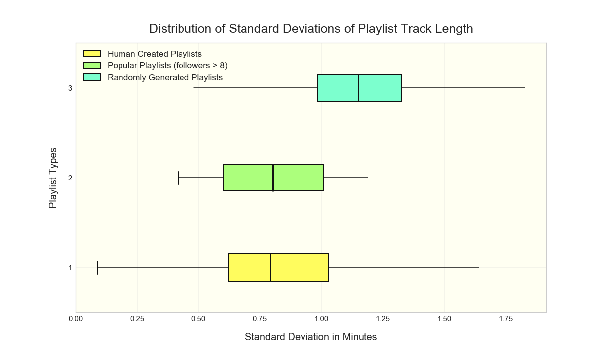
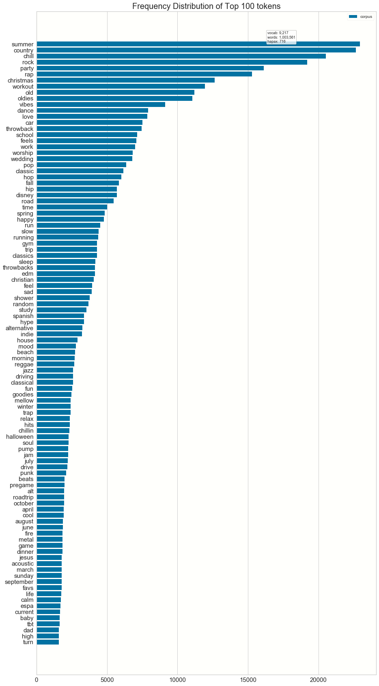
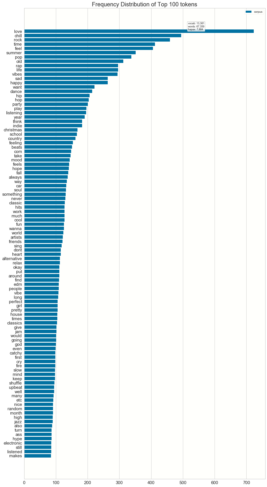

### Table of Contents
[Project Statement and Goals](https://tralpha.github.io/spotify-project/project-statement-and-goals.html) <br>
[Motivation and Background](https://tralpha.github.io/spotify-project/motivation-and-background.html) <br>
[Data Description](https://tralpha.github.io/spotify-project/data-description.html) <br>
[EDA](https://tralpha.github.io/spotify-project/eda.html) <br>
[Data Cleaning](https://tralpha.github.io/spotify-project/data-cleaning.html) <br>
[Metrics](https://tralpha.github.io/spotify-project/metrics.html) <br>
[Model Training](https://tralpha.github.io/spotify-project/model-training.html) <br>
[Interpreting the Model](https://tralpha.github.io/spotify-project/interpreting-the-model.html) <br>
[Model Testing and Results](https://tralpha.github.io/spotify-project/model-testing-and-results.html) <br>
[Conclusion and What's Next](https://tralpha.github.io/spotify-project/conclusion.html) <br>
[Literature Review](https://tralpha.github.io/spotify-project/literature-review.html) <br>

# Exploratory Data Analysis:

The data that we have is a trove of information.  The MPD is over 5 gigs of json files of (mostly) random playlists that Spotify has grabbed from unnamed users.  One of the principle challenges of this project is training on such a quantity of categorical data with limited computing resources.

It took some time and effort to vectorize the textual information in the dataset and to manage the sparse matrices that result.  In initially considerations about how a decision tree classifier might work on just the quantitative data, track length seemed to have some potential in descriminating songs that fit a playlist from those that don't.  We wondered, given a playlist, what the standard deviation of song duration might look like. If we find that this deviation for playlists tends to be very low, it could give us evidence that song duration is a significant feature. In order to better understand what standard deviation should be considered low, we start by noting that the average track duration across our entire subset of playlists is about 3.9 minutes with a standard deviation of about 1.4 minutes.  Below is plotted the distribution of stds for real (human generated) playlists in our dataset, playlists with many followers and playlists that we randomly generated (see the **data cleaning** section of this site):

```python
# get lists of standard deviations of song length for each playlist for playlists 
# made by humans, playlists randomly generated, and playlists with many followers 

# Get number of playlists loaded into dataset and initialize np arrays to hold stats
num_playlists = dataset["playlist_pid"].nunique()

match_stds = np.full(num_playlists, np.nan)
followers_match_stds = np.array([])
neg_match_stds = np.full(num_playlists, np.nan)

match_ratio = np.full(num_playlists, np.nan)
followers_ratio = np.array([])
neg_match_ratio = np.full(num_playlists, np.nan)

 # define what is many followers
many = 8           

#loop through playlists and get statistics for true playlists in dataset (match column = 1)
# and for playlists that we randomly generated (match column = 0)
index = 0
for tup, df in tqdm(dataset.groupby(["playlist_pid", "match"])):
    deviation = np.std(df.track_duration_ms / 60000)
    num_artists = df.track_artist_name.nunique()
    num_tracks = df.track_name.nunique()
    ratio = num_tracks / num_artists
    
    if tup[1] == 1:  #df is full of only matching songs
        match_stds[index] = deviation
        match_ratio[index] = ratio
        if df.playlist_num_followers.iloc[0] > many:
            followers_match_stds = np.append(followers_match_stds, deviation)
            followers_ratio = np.append(followers_ratio, ratio)
        index += 1
    else:            #df is full of non_matching songs
        neg_match_stds[index] = deviation
        neg_match_ratio[index] = ratio
 ```
 
 ```python
#Create boxplots and display
fig, ax = plt.subplots(1,1, figsize = (17, 10))

boxes = ax.boxplot([match_stds, followers_match_stds, neg_match_stds], 
           showfliers = False, 
           vert = False,
           patch_artist = True,
           boxprops = {"lw": 2}, 
           whiskerprops = {"linewidth": 1.5},
           medianprops = {"linewidth": 3, "color": "k"}
          )
colors = ['#fffc5e', "#acff7c", "#7cffce"]
for patch, color in zip(boxes['boxes'], colors): 
    patch.set_facecolor(color)
ax.legend([boxes["boxes"][0], boxes["boxes"][1], boxes["boxes"][2]], 
          ["Human Created Playlists","Popular Playlists (followers > " + str(many)+ ")", 
           "Randomly Generated Playlists"], 
          fontsize = "x-large", loc = "upper left")
ax.set_xlabel("Standard Deviation in Minutes", fontsize = 20, labelpad=20)
ax.set_ylabel("Playlist Types", fontsize = 20, labelpad=20)
ax.set_title("Distribution of Standard Deviations of Playlist Track Length", fontsize = 25, pad=20);
```



We find that when people create playlists (bottom and middle whisker plots) they tend to vary track duration less than a random algorithm would.  Clearly there is much more to a person’s taste in music than just the length of songs; however, we believe that song length is at least a component of what makes a song enjoyable or not.  Pace contributes to the aura of a harmonious playlist and is palpable to the listener. A song’s length is also likely correlated with other relevant factors such as genre, time period and level of energy. A playlist created for studying would probably benefit from longer songs than one intended for powerlifting.

## Using playlist name and description as a proxy for song meta-data
We cleaned up the playlist names and descriptions as part of the [Data Cleaning](https://tralpha.github.io/spotify-project/data-cleaning.html). We have looked at the top playlist names in the [Data Description](https://tralpha.github.io/spotify-project/data-description.html). 

We now go one step further and we analyse the frequency of individual words in playlist names.

The top 100 words for playlist names seem to be categorical in nature as well


The top 100 words for playlist descriptions are also categorical


So using the words in the playlist name and the descriptiondoes indeed seems like a good proxy for the song meta-data
