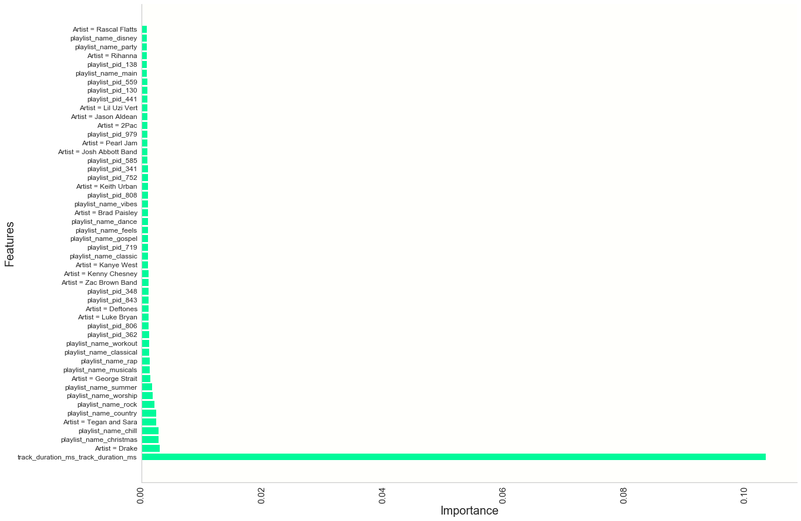

## Table of Contents
[Project Statement and Goals](https://tralpha.github.io/spotify-project/project-statement-and-goals.html) <br>
[Motivation and Background](https://tralpha.github.io/spotify-project/motivation-and-background.html) <br>
[Data Description](https://tralpha.github.io/spotify-project/data-description.html) <br>
[EDA](https://tralpha.github.io/spotify-project/eda.html) <br>
[Data Cleaning](https://tralpha.github.io/spotify-project/data-cleaning.html) <br>
[Metrics](https://tralpha.github.io/spotify-project/metrics.html) <br>
[Data Cleaning](https://tralpha.github.io/spotify-project/data-cleaning.html) <br>
[Model Training](https://tralpha.github.io/spotify-project/model-training.html) <br>
[Interpreting the Model](https://tralpha.github.io/spotify-project/interpreting-the-model.html) <br>
[Model Testing and Results](https://tralpha.github.io/spotify-project/model-testing-and-results.html) <br>
[Literature Review](https://tralpha.github.io/spotify-project/literature-review.html) <br>

# Interpreting The Model

**Visualization**

```python
#Get important features and visual for features
#get top feature indices and ratings

importances = AdaModel.feature_importances_
indices = np.argsort(importances)[::-1]

top50index = []
top50importance = []
for f in range(50):
    top50index.append(indices[f])
    top50importance.append(importances[indices[f]])
```

```python
#helper in getting top features and making visual
#convert relevant dataframe columns to lowercase so we can compare with top feature output

track_artist_lower_df = tracks_df["track_artist_uri"].apply(lambda x: x.lower())
track_album_lower_df = tracks_df["track_album_uri"].apply(lambda x: x.lower())
merged_track_uri_lower_df = merged["track_uri"].apply(lambda x: x.lower())

#Take a uri and return album, artist or song title in plain english
def get_translation(uri_type, uri):
    
    track = False  #if a single track/song is input as uri, I need to handle it differently
    if uri_type == "track_artist_uri":
        df = track_artist_lower_df
        col = "track_artist_name"
    elif uri_type == "track_album_uri":
        df = track_album_lower_df
        col = "track_album_name"
    elif uri_type == "track_uri":
        df = merged_track_uri_lower_df
        col = "track_name"
        track = True   #Handle track_name differently by going to the merged df
    for i in range(len(tracks_df)):
        if df[i] == uri:
            if track == True:
                return merged.iloc[i][col]
            return tracks_df.iloc[i][col]
            break
```

```python
#Make list of top features
feature_names = []

#Loop through the indices of top features and append them to a list in plain english, not uri info
for i in top50index:
    feature = vectorizer.get_feature_names()[i].split("__")
    if feature[0] == "track_artist_uri":
        feature_names.append("Artist = " + get_translation("track_artist_uri", feature[1]))
    elif feature[0] == "track_album_uri":
        feature_names.append("Album = " + get_translation("track_album_uri", feature[1]))
    elif feature[0] == "track_uri":
        feature_names.append("Song = " + get_translation("track_uri", feature[1].lstrip()))
    
    else:
        feature_names.append(feature[0] + "_" + feature[1])
```

```python
#plot

fig, ax = plt.subplots(1,1, figsize = (20,15))
y_pos = np.arange(len(feature_names))
ax.barh(feature_names, top50importance, align = "center", color = "mediumspringgreen")
for tick in ax.get_xticklabels():
    tick.set_rotation(90)
ax.grid(alpha = 0)
ax.set_xlabel("Importance", fontsize = 20)
ax.set_ylabel("Features", fontsize = 20)
ax.yaxis.set_tick_params(labelsize=12)
ax.xaxis.set_tick_params(labelsize=15)
```





**General Thoughts**
We can note a few things about the features our model found most relevant for making split decsions.  The overarching theme is that although we have a plethora of features, we are lacking in highly important features.  As we suspected, track duration is the most relevant feature by a wide margin and even it is not terribly important on its own.  Most other features are categorical where a large set of classes are possible, so they tend to spread importance level thin.  For example, artists that the model found to be good splits were 'Drake', 'Tegan and Sara', 'Deftones', 'Pearl Jam', 'Rihanna', 'Luke Bryan' and 'Kanye West'.  These artists, although, disproportionately popular, share feature importance with so many of the other almost 300,000 unique artists in the MPD.  Going into further hyperparameter tuning after seeing features are weak discriminators on average, we can get some intuition that a Random Forest model is going to be dependent on deep trees to make good classification matches for playlists.  Likewise, an AdaBoost will be dependent on a relatively high number of iterations to be sucessful.  

**Important Artists**
In our earlier Data Description, 'Drake', 'Rihanna', 'Kanye West' and 'Luke Bryan' were in fact found to be in the top 30 artists represented in the MPD, so it's reasonable that a tree would often encounter them and find the information somewhat relevant.  It was interesting to see, though, that artist popularity was not the only determining factor in artists making it into the most important features.  Other very popular artists like Eminem, Beyonce and Coldplay did not factor into the top 50 features, whereas less popular artists like Deftones did.  Perhaps people who listen to Deftones tend to listen to only a few songs or are highly likely to listen to a small number of other artists like Deftones.  If that was the case, we could see how Deftones could play a large role in a tree purifying its branches and making correct classifications.  

**Important Playlist Names**
As with artists, some of the most popular playlist names such as 'country', 'christmas', 'rock', and 'disney' also show up in top features and for good reason.  The variety of songs showing up in the approximately 4,000 playlists named 'disney' in the MPD must be far less than the over 2,000,000 unique songs in MPD, thus, a tree is going to go a long way to purifying its branches by splitting on 'disney'.  Moreover, many of these important playlist names contain imformation that is clearly expressing genre or mood: the playlist name 'chill' was the 4th most important feature.  Similar to what we saw with artits, important playlist names are not necessarily among the most popular.  'Gospel' is an important feature more for its ability to differentiate a playlist than it being very common.

**Playlist pid**
Playlist pid is central to our vision for how our model works.

**Conclusions**
To expand on our recommendation system, we would benefit from features that are more powerful in the way they discriminate between songs that match and playlist and songs that don't.  We could explore other quantitative features such as average tempo or loudness of songs in a playlist.  Our model could also gain much classification ability by having more features related to mood, atmosphere and purpose since playlist names that indicated these things were useful.  It will be exciting to see how much better playlist continuations systems get as more relevant data comes online that is either quantitative or ,if categorical, is limited to a small number of categories, unlike artist.
