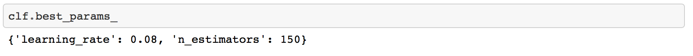
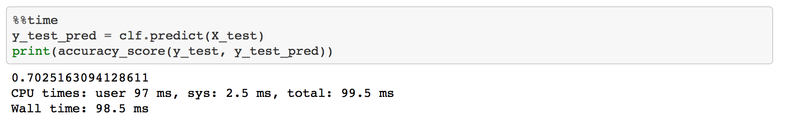

## Table of Contents
[Project Statement and Goals](https://tralpha.github.io/spotify-project/project-statement-and-goals.html) <br>
[Motivation and Background](https://tralpha.github.io/spotify-project/motivation-and-background.html) <br>
[Data Description](https://tralpha.github.io/spotify-project/data-description.html) <br>
[EDA](https://tralpha.github.io/spotify-project/eda.html) <br>
[Data Cleaning](https://tralpha.github.io/spotify-project/data-cleaning.html) <br>
[Metrics](https://tralpha.github.io/spotify-project/metrics.html) <br>
[Data Cleaning](https://tralpha.github.io/spotify-project/data-cleaning.html) <br>
[Model Training](https://tralpha.github.io/spotify-project/model-training.html) <br>
[Interpreting the Model](https://tralpha.github.io/spotify-project/interpreting-the-model.html) <br>
[Model Testing and Results](https://tralpha.github.io/spotify-project/model-testing-and-results.html) <br>
[Literature Review](https://tralpha.github.io/spotify-project/literature-review.html) <br>


This merged dataframe is split into a training and test set using the `sklearn` `train_test_split` function. Because we have a large dataset, we choose to reserve 10% of our dataset for testing purposes. 

This train dataframe (called `data_train` in code) is then vectorized to obtain features to be trained using our model. We vectorize because our algorithm cannot be ran directly on text, so we need to extract features before training. We do the feature extraction using a `FeatureUnion` class from sklearn, which concatenates together binary features from different main text features, from the original merged dataset. The feature we consider for the problem are:

1. `track_artist_uri`
2. `track_album_uri`
3. `track_uri`
4. `playlist_pid`
5. `playlist_name`
6. `playlist_description`
7. `track_duration_ms`

The vectorizer is fit on the training set, to obtain a big matrix of features, `X_train`. This `X_train` matrix contains about 106000 features when 2000 playlists are loaded, together with 241000 observations. We believe as more playlists are loaded, the observations to features ratio increases, which should make it easier for the algorithm to distinguish between positive and negative playlist+track concatenations after training.

We then transform our `X_test` matrix to obtain a similar matrix, with the same number of features as the `X_train`. 


After both the training and test matrices are obtained, we build a grid search pipeline using `GridSearchCV` to obtain an optimized version of `AdaBoostClassifier`, the algorithm we chose to use for our model. We chose Adaboost because by default it's a non-linear model, and we strongly believe that due to the number of features and the number of observations in the dataset, the decision boundary will be non-linear. Adaboost is also an ensemble algorithm, so it tends to outperform other simpler algorithms, which is another reason we chose to use it. 

The `GridSearchCV` takes some time to run, but finally outputs our optimized classifier, which has parameters: `n_estimators: ` and `learning_rate: `.

```python
# Basic cross-validation with Grid Search CV
AdaModel = AdaBoostClassifier()
parameters = {
    'n_estimators': range(50, 200, 50),
    'learning_rate': np.arange(0.01, 0.09, 0.01)
}
clf = GridSearchCV(
    AdaModel,
    parameters,
    n_jobs=-1,
    verbose=20,
    cv=KFold(2, shuffle=True),
    scoring=make_scorer(accuracy_score))
clf.fit(X_train, y_train)
```


```python
y_pred = clf.predict(X_train)
print(accuracy_score(y_train, y_pred))
```
1.0



This optimized model gives us training accuracy of `x.x`, and test set accuracy of `x.x`. What this means is that on the training set, the model learns how to perfectly distinguish between tracks which should belong to a playlist and tracks which should not belong to a playlist. However, on the test set, the model is still doing some errors. Looking at the model's performance on the test set, we thought this was good enough, and decided to proceed to using the algorithm to actually recommend songs, and obtain an `r_precision` score on our recommender model. How we do this exactly is explained in the next section, `model-testing-and-results.md`.


## Vectorizing the Data to Extract Word Features and One Hot Encode Categoricals
In order to take advantage of our text features like playlist name and playlist description we use a text word count vectorizer.  By vectorizing we also make features such as `playlist_pid` categorical in nature.  Afterall, the order of `playlist_pid` in our dataset is meaningless for our purposes. 

```python
class ItemSelector(BaseEstimator, TransformerMixin):
    """For data grouped by feature, select subset of data at a provided key.

    The data is expected to be stored in a 2D data structure, where the first
    index is over features and the second is over samples.  i.e.

    >> len(data[key]) == n_samples

    Please note that this is the opposite convention to scikit-learn feature
    matrixes (where the first index corresponds to sample).

    ItemSelector only requires that the collection implement getitem
    (data[key]).  Examples include: a dict of lists, 2D numpy array, Pandas
    DataFrame, numpy record array, etc.

    >> data = {'a': [1, 5, 2, 5, 2, 8],
               'b': [9, 4, 1, 4, 1, 3]}
    >> ds = ItemSelector(key='a')
    >> data['a'] == ds.transform(data)

    ItemSelector is not designed to handle data grouped by sample.  (e.g. a
    list of dicts).  If your data is structured this way, consider a
    transformer along the lines of `sklearn.feature_extraction.DictVectorizer`.

    Parameters
    ----------
    key : hashable, required
        The key corresponding to the desired value in a mappable.
    """
    def __init__(self, key):
        self.key = key

    def fit(self, x, y=None):
        return self

    def transform(self, data_dict):
        # if self.key == 'playlist_pid': from IPython.core.debugger import set_trace; set_trace()
        return data_dict[:,[self.key]].astype(np.int64)

    def get_feature_names(self):
        return [dataset.columns[self.key]]
```

```python
# we need a custom pre-processor to extract correct field,
# but want to also use default scikit-learn preprocessing (e.g. lowercasing)
default_preprocessor = CountVectorizer().build_preprocessor()


def build_preprocessor(field):
    field_idx = list(dataset.columns).index(field)
    # if field == 'playlist_pid': from IPython.core.debugger import set_trace; set_trace()
    return lambda x: default_preprocessor(x[field_idx])


vectorizer = FeatureUnion([
    (
        'track_artist_uri',
        CountVectorizer(
            ngram_range=(1, 1),
            token_pattern=r".+",
            stop_words=None,
            # max_features=50000,
            preprocessor=build_preprocessor('track_artist_uri'))),
    (
        'track_album_uri',
        CountVectorizer(
            ngram_range=(1, 1),
            token_pattern=r".+",
            stop_words=None,
            # max_features=50000,
            preprocessor=build_preprocessor('track_album_uri'))),
    (
        'track_uri',
        CountVectorizer(
            ngram_range=(1, 1),
            token_pattern=r".+",
            stop_words=None,
            # max_features=50000,
            preprocessor=build_preprocessor('track_uri'))),

    (
        'playlist_pid',
        CountVectorizer(
            ngram_range=(1, 1),
            token_pattern=r".+",
            stop_words=None,
            # max_features=50000,
            preprocessor=build_preprocessor('playlist_pid'))),

    ("playlist_name",
      CountVectorizer(
            ngram_range=(1, 1),
            token_pattern=r"(?u)\b\w+\b",
            stop_words=None,
            analyzer = 'word',
            # max_features=50000,
            preprocessor=build_preprocessor("playlist_name"))),
    
    ("playlist_description",
      CountVectorizer(
            ngram_range=(1, 1),
            token_pattern=r"(?u)\b\w+\b",
            stop_words=None,
            analyzer = 'word',
            # max_features=50000,
            preprocessor=build_preprocessor("playlist_description"))),
#     (
#         'track_pos',
#         CountVectorizer(
#             ngram_range=(1, 1),
#             token_pattern=r".+",
#             stop_words=None,
#             # max_features=50000,
#             preprocessor=build_preprocessor('track_pos'))),

    ('track_duration_ms',
     ItemSelector(list(dataset.columns).index('track_duration_ms'))),
])
X_train = vectorizer.fit_transform(data_train.values)
X_test = vectorizer.transform(data_test.values)
```
